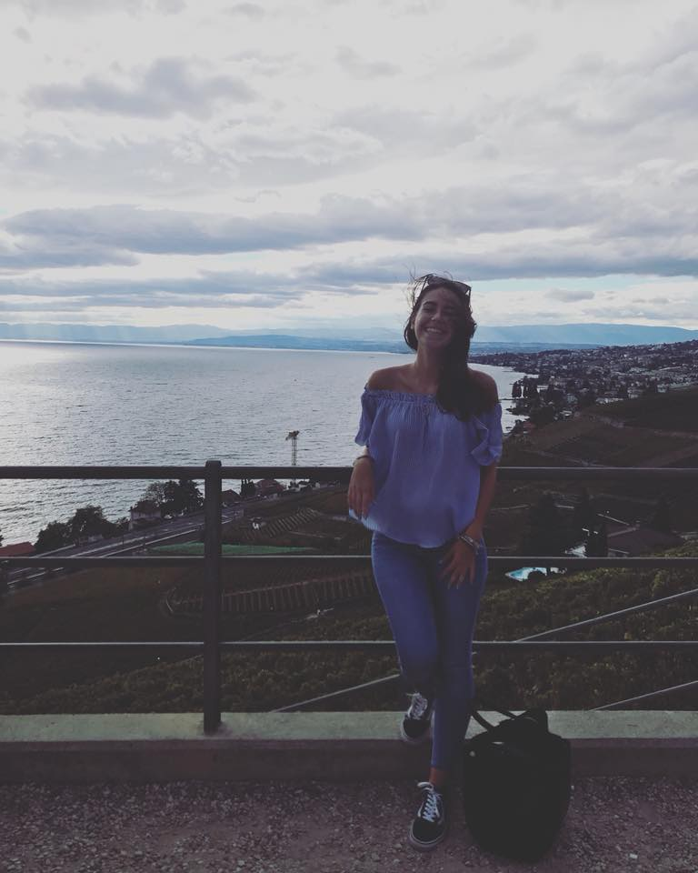
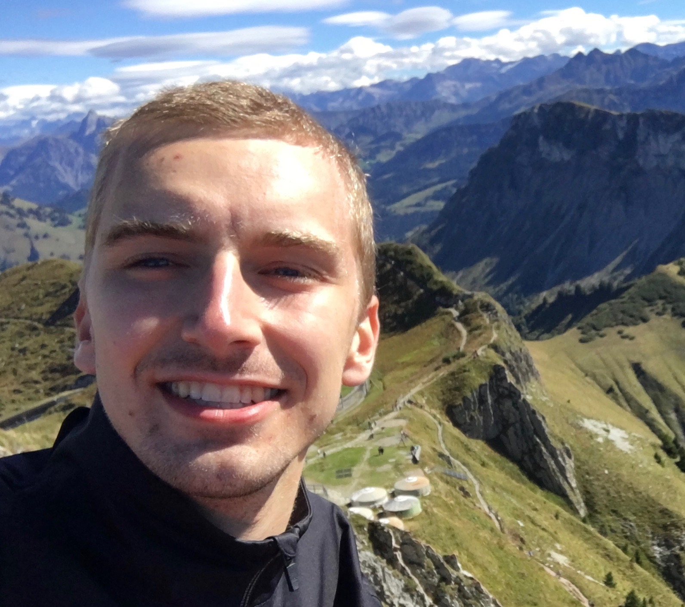
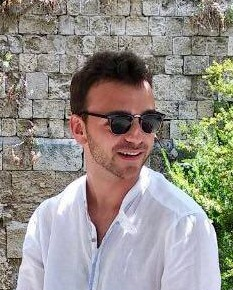

```{r setup, include=FALSE, comment= NA}
knitr::opts_chunk$set(echo = TRUE)
```

## Introduction

Members of group 3 introducing themselves...


<style>
video {
    display: block;
    margin-left: auto;
    margin-right: auto;
    width: 50%;
}
</style>

<video width="320" height="240" controls>
  <source src="video.mpg" type="video/mpg" class="center">
</video>

<p style="text-align:right;">... each in their own language</p>

As you can see, our group is awesome. We are three exchange students and two full-degree students. Three Italians, a Belgian and a Dane. No Swiss, but one French-speaking.

We have structured our solution so that everybody has done their own part and then we divided the remaining parts in the group so that everybody could contribute. The work has been managed through Github with limited conflicts.

## Group Members {.tabset .tabset-pills}

### Cristina


My name is Cristina and I come from Milan, Italy where I am studying Business Analytics and Big Data at Politecnico di Milano.
Right now I am at HEC in Lausanne as an exchange student within the QTEM master's network. During this months I will attend the following courses:

Class | Time 
--- | --- 
Programming Tools in Data Science | Tueseday 1:15 pm
Computational Tools for Actuaries | Thuesday 8:30 am
Conceptual Modelling for Business Analytics | Thuesday 1:30 pm
Data Analytics for Decision Making | Friday 8:30 am

The things that I am passionate about are:

* Sports: Volleyball, Skii, Surf, Wakeboard 
* Art: I love reading about art and going to exibitions, expecially about Contemporary Art
* Music: I listen to Rock, Indie-rock and Electronic music and I love going to concerts and festivals
* Travel: I like discover new cultures and meet new people

A **fun fact** about me is that I am super clumsy, I have the ability to drop everything I am holding and to hit everything that is around me. So don't ask me to hold your phone or to take care of something precious if you don't want it totally smashed :D

> "Whenever humanity seems condemned to heaviness, I think I should fly like Perseus into a different space. I do not mean escaping into dreams or the irrational. I mean that I have to change my approach, look at the world from a different perspective, with a different logic and with fresh methods of cognition and verification."
>
> <p style="text-align:right;"><cite>Italo Calvino, Six Memos For The Next Millennium</cite></p>

### Laura




I have different passions:

* Reading: I think it is my greatest passion. I like to enter in new worlds and to live new lifes.
* Music: I come from a family of musicians. I don't have a favorite genre, I listen to every type of music.
* Travel: I like to discover new cities and countries. Moreover, I found beautiful to visit a city where a book that I read was set, in this way I feel part of the story

A **fun fact** about me is that when I travel I found always (always!!) one of the main attraction of the city with a scaffolding that hides it. So my photos are always ruined by the work in progress.

> Very little is needed to make a happy life; it is all within yourself, in your way of thinking. 
>
> <p style="text-align:right;"><cite> Marcus Aurelius </cite></p>

I am attending the second year of the Master in Management, and this is my timetable for this semester:

Subject | Timetable 
---|---
Managerial Decision Making and Negotiation | Tuesday 8.30 
Programming Tools in Data Science | Tuesday 13.15 
Unethical Decision Making | Wednesday 8.30 
Strategy and Development Modes | Wednesday 14.15 
Business and Human Rights | Thursday 13.15 


### Emil

---

My name is Emil and I am on exchange at HEC Lausanne this semester. Originally, I am on my 2nd you of Msc in Business Administration and Information Systems from Copenhagen Business School.


I generally find it easy to get passionate about vastly different things, but it always comes back to..

* Football, which allows me to chill with mates, exercise and compete at the same time
* Politics, which I could read about all day long
* Travelling, as I love visiting new places. 2018 has brought me to:
    - Denmark (where I live when not on exchange)
    - Singapore
    - Malaysia
    - US
    - Germany
    - Czech Republic
    - Austria
    - Slovakia
    - Hungaria
    - Italy (twice)
    - Norway (tomorrow)
* Case competitions, business and entrepreneuship
 
A **fun fact** about me is that my grandpa hasn't written an encyclopedia of 18 
volumes about the European litterature. Oh, and I don't drink coffe (what?!).

This is my favorite qoute. You should try to translate it [here.](https://translate.google.dk/#da/en/Verden%20har%20brug%20for%20flere%20ydmyge%20genier.%20Der%20er%20efterh%C3%A5nden%20for%20f%C3%A5%20af%20os)

> "Verden har brug for flere ydmyge genier. Der er efterh?nden for f? af os." 
>
> <p style="text-align:right;"><cite>Drillo</cite></p>

Class | Time 
--- | --- 
Power and Leadership | Monday 8:30 am
Mergers, Acquuisitions and Corporate Restructurings | Monday 1:15 pm
Programming Tools in Data Science | Tueseday 1:15 pm
Strategy and Development Modes | Wednesday 2:15 pm
Entrepreneurship and Strategy | Friday 8:30 am

### Louis



---

I'll say yes to anything you offer me to do but I am particularly fond of

* Theatre, where I can express myself in various ways 
* Running, which keeps me full of energy
* Classical music
    - Brams
    - Litz
    - Beethoven
* Tennis, which helps me fulfill my need for competition 
 

I am also very good at learning new languages and therefore enjoy learning new 
ones. Unfortunately, I am talking about natural languages, my gift doesn't seem
to work as well with programming ones.

A **fun fact** about me is that my grandpa has written an encyclopedia of 18 
volumes about the European litterature.

> "Ce que les gens ne peuvent pas comprendre leur fait peur, et ce qui leur fait
peur ils veulent le d&eacute;truire" 
>
> <p style="text-align:right;"><cite>Werber, L'Ultime Secret</cite></p>

Class | Time 
--- | --- 
Data Mining | Monday 8:30 am
Programming Tools in Data Science | Tueseday 1:15 pm
Machine Learning in Business Analytics | Wednesday 1:15 pm
Optimization Methods in Business Analytics | Friday 3:15 pm


### Federico

Hi! My name is Federico and I come from Como, in Italy.
I did my Bachelor in Lugano and now I am attending a master in Lausanne.
I study management but I have other interests, such as literature and politics.



I dedicate my spare time to some hobbies:

* practice sports, like tennis, skiing and swimming
* read poems, and sometimes learn them by heart
* travelling, preferably by car, since I love driving

A **fun fact** about me is that if I drink coke while I am tired, 
I literally start to rave. Please, keep me far from a can of coke!

> dies nihil est. Dum versas te, nox fit. 
> Itaque nihil est melius quam de cubiculo 
> recta in triclinium ire.
> Vinus mihi in cerebrum abiit.
>
> <p style="text-align:right;"><cite>Petronius</cite></p>

Subject | Time
---|---
Power and Leadership | Monday 8.30
Managerial Decision Making and Negotiation | Tuesday 8.30 
Programming Tools in Data Science | Tuesday 13.15 
Unethical Decision Making | Wednesday 8.30 
Strategy and Development Modes | Wednesday 14.15 

## RMarkdown Syntax

1. Show an example where the chunk option cache = T leads to a misleading answer:

```{r, cache = TRUE, comment= NA}
a <- Sys.time() 
print(paste0("Today is the ", a))
```
---


2. Simulate 100 random samples from a standard normal distribution using the function rnorm(). Store these 100 values in a vector called x. Then, compute the empirical median, mean and variance of x. Are these results different from 0, 0 and 1 (their respective theoretical values)? Is this result surprising? Justify your answer.

```{r,include=TRUE, comment= NA}
x <- rnorm(n = 100)
median(x)
mean(x)
var(x)
```

Rnorm gives a random sample of 100 values from distribution mean = 0 and sd = 1. Because it is random, the actual values of mean, median & var depend on which particular values it gets back from the randomization. 
There is no guarantee that the mean will be exactly 0, but statistically it should converge to 0 using larger sample sizes.

3. Include a graph showing the histogram of x (make sure to include a caption to this figure). You can use the R function hist() or the ggplot2 function.

```{r, echo = TRUE, fig.width = 5, fig.height = 5, fig.align = TRUE}
hist(x)
```

4. Inlcude the following equation:

$$\mathbb{E} \left[ var \left\{ \boldsymbol{\upsilon_1} 
\left(\boldsymbol{\widehat\theta}, n \right) \mid \boldsymbol{\widehat\theta} 
\right\} \right] = 
\mathrm{var} \left\{ \textbf{v}_1 (\boldsymbol{\theta_0} ,n) \right\} + 
\mathbb{E} \left[ \mathcal{O_p} \left\{ \boldsymbol{\mathbf{D}}_1 
(\boldsymbol{\theta}^* ,n ) (\boldsymbol{\widehat\theta} - \boldsymbol{\theta}_0)
, ... , \boldsymbol{\mathbf{D}}_p (\boldsymbol{\theta}^* ,n ) 
(\boldsymbol{\widehat\theta} - \boldsymbol{\theta}_0 ) \right\} \right] 
= \mathrm{var} \{ \textbf{v}_1 (\boldsymbol{\theta}_0 ,n )\} + \mathcal{O_p}(n^{-2})$$


5. Include the following in-line equation:

$\large{ \mathbf{A} \equiv [ a_{i,j}]_{i,j = 1, ... , p} }$

6. Include the following text in blue: "V&eacute;rit&eacute; dans un temps, erreur
dans un autre", Charles de Montesquieu

<p style="text-align:center;"><span style="color:blue">"V&eacute;rit&eacute; 
dans un temps, erreur dans un autre.", *Charles de Montesquieu*</span></p>


7. Include a &quot;More info&quot; button with hide/unhide functionality.

<p>**Knock Knock**</p>
<p>*Who's there?*</p>
<p>**Nana**</p>
<p>*Nana who?*</p>
<p><span id="dots">...</span></p>
<span id="more">
<p>**NANA YOUR BUSINESS**</p>
</span>
<button class="button" onclick="myFunction()" id="myBtn">Show Answer</button>

<script>
function myFunction() {
  var dots = document.getElementById("dots");
  var moreText = document.getElementById("more");
  var btnText = document.getElementById("myBtn");

  if (dots.style.display === "none") {
    dots.style.display = "inline";
    btnText.innerHTML = "Show Answer"; 
    moreText.style.display = "none";
  } else {
    dots.style.display = "none";
    btnText.innerHTML = "Hide Answer"; 
    moreText.style.display = "inline";
  }
}
</script>

<style> #more {display: none;} </style>

<style>
.button {
  border-radius: 4px;
  background-color: #f4511e;
  border: none;
  color: #FFFFFF;
  text-align: center;
  font-size: 15px;
  padding: 10px;
  width: 150px;
  transition: all 0.5s;
  cursor: pointer;
  margin: 5px;
}

.button span {
  cursor: pointer;
  display: inline-block;
  position: relative;
  transition: 0.5s;
}

.button span:after {
  content: '\00bb';
  position: absolute;
  opacity: 0;
  top: 0;
  right: -20px;
  transition: 0.5s;
}

.button:hover span {
  padding-right: 25px;
}

.button:hover span:after {
  opacity: 1;
  right: 0;
}
</style>

<br>

8. Include a color box with some text

<style>
div.blue pre { background-color:lightblue; }
div.blue pre.r { background-color:lightblue; }
</style>

<div class = "blue">
```{r bluecars, comment= NA}
summary(cars)
```
</div>
---


## References

@ItaloCalvino
@werber2010ultime
@Drillo2010
@MarcusAurelius
@Petronius
@baron1897lettres
